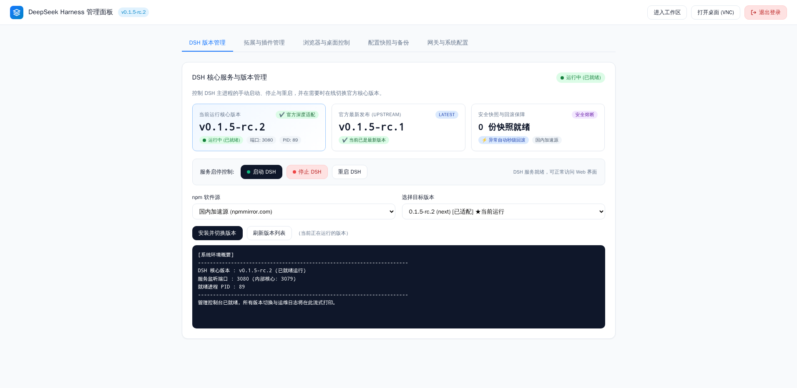
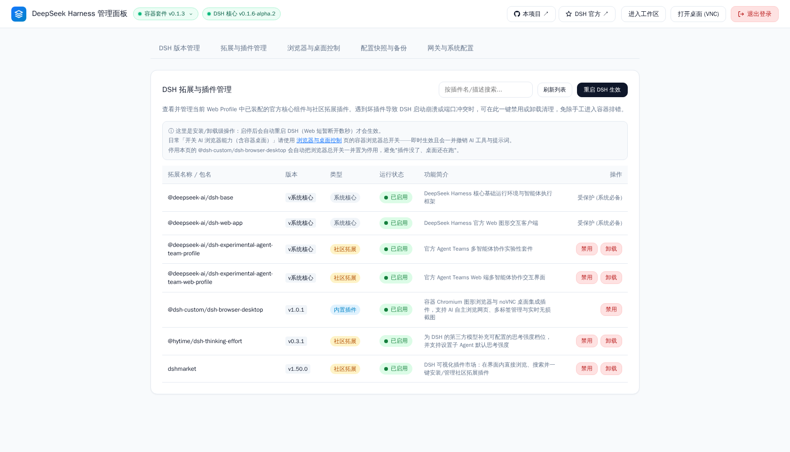
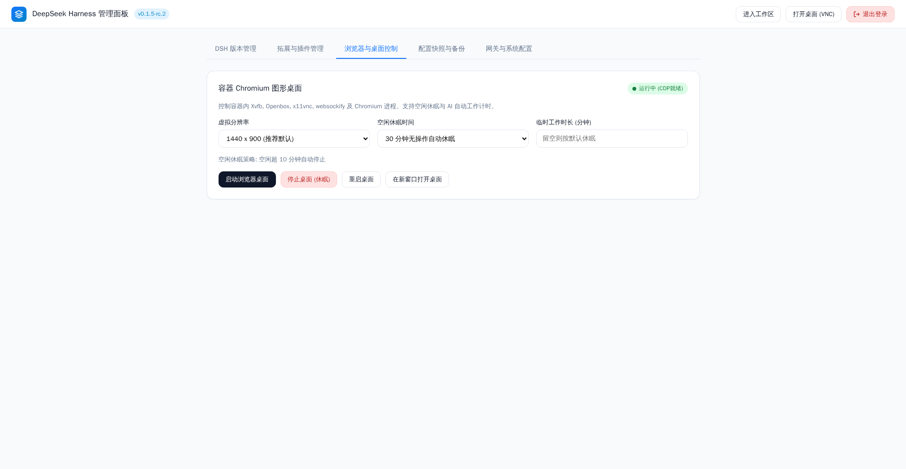
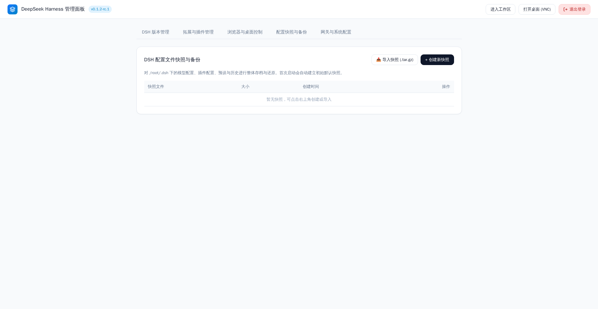
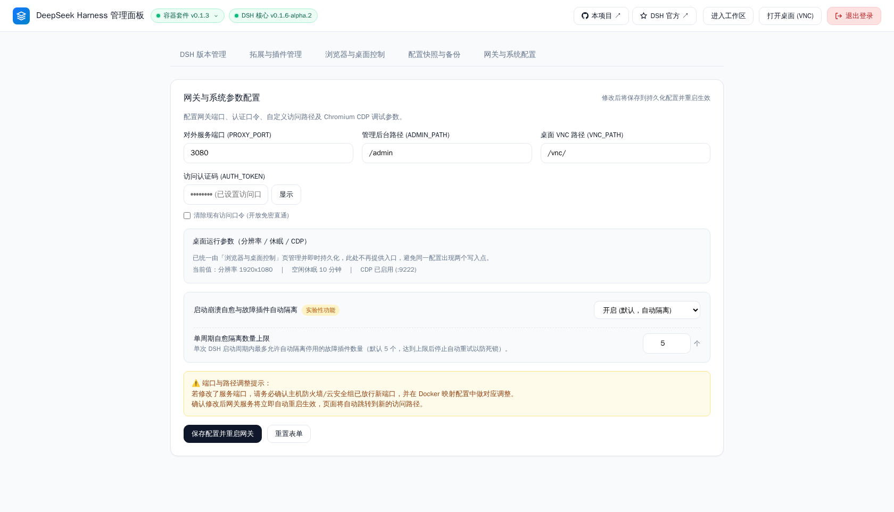
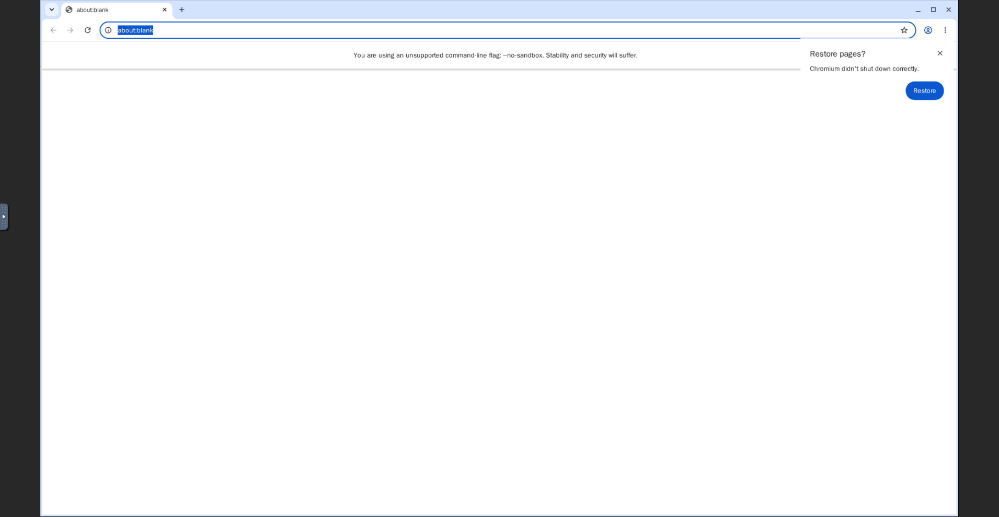
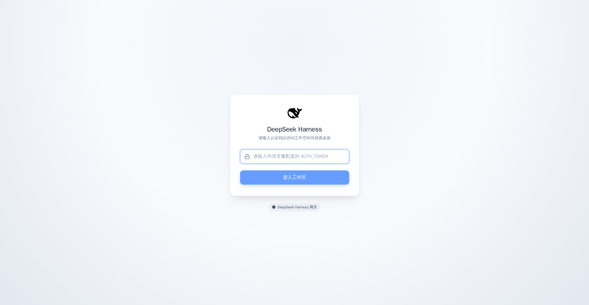
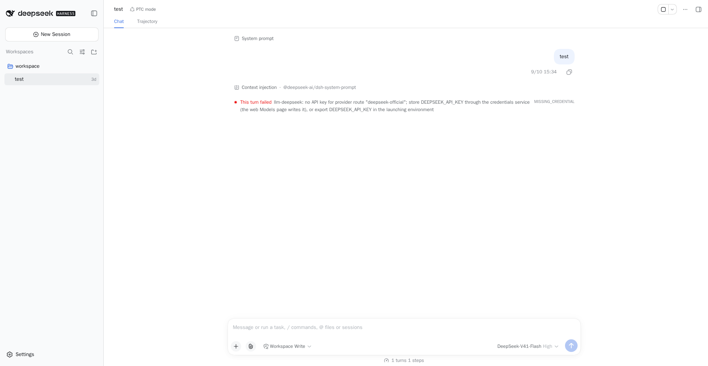

# DeepSeek Harness Docker

专为官方 DeepSeek Harness 打造的**生产就绪型容器化套件与可视化 Web Admin 控制台**。一键解决回环网络限制、集成高颜值口令认证、内置 Chromium 桌面 (noVNC)，并通过**强大的后台管理面板**实现版本在线热切换、插件市场、配置快照与备份。

简单来说：**自带强大 Admin 控制台，Docker 一键梭哈，开箱即用。**

---

## 🎛️ 核心亮点：强大好用的 Web Admin 控制台展示

本项目核心特色在于内置了功能完备、极简美观的 Web 管理控制台（访问 `/admin/` 即可进入）：

| 1. DSH 核心版本管理与热切换 | 2. 扩展与插件市场可视化管理 |
| :---: | :---: |
|  |  |
| 支持核心进程启停、在线版本检查、一键安装/切换任意 DSH 版本（支持 npmmirror 国内源加速） | 内置插件市场，支持一键安装、启用/卸载社区与官方扩展插件，自动处理依赖与软链接 |

| 3. Chromium 浏览器与虚拟桌面控制 | 4. 配置快照与一键备份还原 |
| :---: | :---: |
|  |  |
| 动态切换 1080p/2K 分辨率、CDP 9222 远程调试开关、桌面空闲超时休眠与一键唤醒 | 一键生成 `/root/.dsh` 全量配置快照，支持自动定时备份、秒级恢复出厂配置与快照导出 |

| 5. 网关与系统安全配置 | 6. 容器内置真实 Chromium noVNC 桌面 (`/vnc/`) |
| :---: | :---: |
|  |  |
| 热修改访问认证码、自定义后台管理路径与桌面路径、反向代理与安全频率限制 | 真实图形化桌面，配合 `dsh-browser-desktop` 插件，AI 可自主操作网页与实时截屏 |

| 7. 极简高颜值访问认证页 (默认口令: `admin`) | 8. 官方 DSH Web 交互工作区 |
| :---: | :---: |
|  |  |
| 告别原生丑陋 Basic Auth 弹窗，采用 DSH 同源灰白科技质感，单输入框极速登录 | 彻底根治回环网络限制与模型配置报错，宿主模式与数据持久化完美运行 |

---

## 🚀 Docker 一键梭哈

### 1. 单行命令极速启动 (推荐)

直接运行以下命令，一键拉取并启动：

```bash
docker run -d \
  --name deepseek-harness \
  --restart unless-stopped \
  -p 3080:3080 \
  -e AUTH_TOKEN=admin \
  -v $(pwd)/data/dsh:/root/.dsh \
  -v $(pwd)/workspace:/workspace \
  -v $(pwd)/data/snapshots:/root/.dsh-snapshots \
  -v $(pwd)/data/browser:/root/.config/chromium \
  ghcr.io/misaka-link/deepseek-harness-docker:latest
```

启动完成后直接访问：
- **Web Admin 管理面板**：`http://<服务器IP>:3080/admin/` ⭐
- **DSH Web 交互工作区**：`http://<服务器IP>:3080/`
- **容器 Chromium 桌面**：`http://<服务器IP>:3080/vnc/`
- **默认认证码**：`admin`（登录后可在后台随时修改）

---

### 2. Docker 容器编排 (docker-compose)

新建 `docker-compose.yml`：

```yaml
services:
  deepseek-harness:
    image: ghcr.io/misaka-link/deepseek-harness-docker:latest
    container_name: deepseek-harness
    restart: unless-stopped
    ports:
      - "3080:3080"
    environment:
      # 访问认证码（用于登录 Web、Admin 后台与 VNC 桌面，留空则免密）
      - AUTH_TOKEN=admin
      - PROXY_PORT=3080
    volumes:
      # DSH 配置与系统目录
      - ./data/dsh:/root/.dsh
      # 项目独立工作区
      - ./workspace:/workspace
      # 配置快照归档库
      - ./data/snapshots:/root/.dsh-snapshots
      # 浏览器缓存目录
      - ./data/browser:/root/.config/chromium
```

一键启动：
```bash
docker compose up -d
```

停止或更新：
```bash
docker compose down && docker compose pull && docker compose up -d
```

---

## ⚙️ 常见环境变量

| 变量名 | 默认值 | 说明 |
|---|---|---|
| `AUTH_TOKEN` | `admin` | 访问认证码（留空则不设密码，放行所有访问） |
| `PROXY_PORT` | `3080` | 统一对外暴露端口（Web、Admin 与 VNC 共用） |
| `ADMIN_PATH` | `/admin` | Web Admin 管理后台访问路径 |
| `VNC_PATH` | `/vnc` | noVNC 图形桌面访问路径 |
| `DSH_WORKSPACE` | `/workspace` | DSH AI 默认工作区目录 |
| `DSH_DESKTOP_ENABLED` | `1` | 是否启用内置 Chromium 图形桌面 (1: 开启, 0: 关闭) |
| `DSH_DESKTOP_WIDTH` | `1920` | 桌面宽度分辨率 (支持后台动态调整) |
| `DSH_DESKTOP_HEIGHT` | `1080` | 桌面高度分辨率 (支持后台动态调整) |
