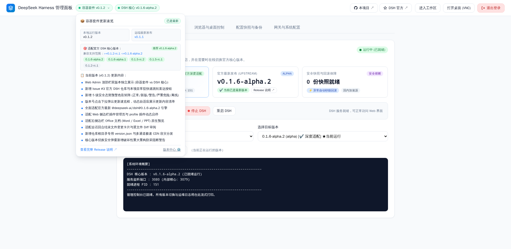
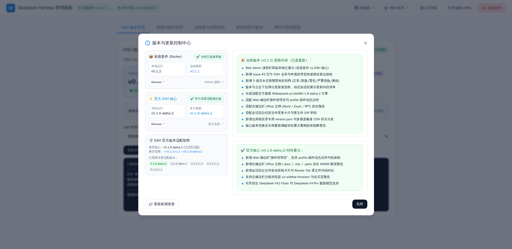
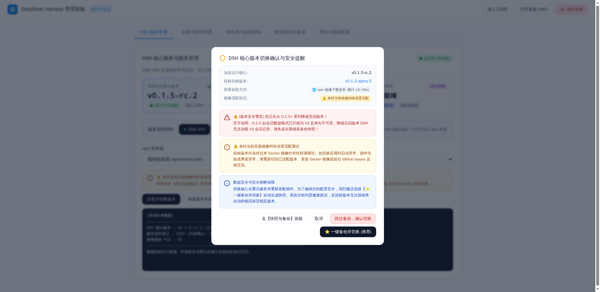

# DeepSeek Harness Docker

> 📌 **版本信息**：兼容支持官方 DeepSeek Harness 核心 `0.1.6-alpha.2` / `0.1.6-alpha.1` / `0.1.5-rc.2` / `0.1.5-rc.1` / `0.1.2-rc.1` ｜ 本项目工程版本 `0.1.4`  
> 🔗 **快速直达链接**：
> - ⚡ **官方 DSH 仓库**：[deepseek-ai/deepseek-harness](https://github.com/deepseek-ai/deepseek-harness) ｜ [官方 Releases 更新日志](https://github.com/deepseek-ai/deepseek-harness/releases) ｜ [npm 官方包页](https://www.npmjs.com/package/@deepseek-ai/dsh)
> - 📦 **本项目 Docker 仓库**：[misaka-link/deepseek-harness-docker](https://github.com/misaka-link/deepseek-harness-docker) ｜ [本项目 Releases](https://github.com/misaka-link/deepseek-harness-docker/releases)
> 🏷️ **镜像标签规范**：默认拉取镜像仍统一保持 **`:latest`**（纯净版）与 **`:latest-market`**（插件商店版），开箱即用；每次构建镜像时，**均会额外多打两个版本标签**：  
> 1. **额外标签一：内置官方 DeepSeek Harness 版本标签**（如 `:0.1.6-alpha.2`、`:0.1.6-alpha.2-market`），精确锁定底层 DSH 官方引擎；  
> 2. **额外标签二：本项目自身的工程版本标签**（如 `:0.1.4`、`:0.1.4-market`），精确锁定本容器套件自身的版本。

专为官方 DeepSeek Harness 打造的**开箱即用容器化套件与可视化 Web Admin 控制台**。基于 **Debian 13 (Trixie) & Node 24 (glibc 2.41)** 现代化运行时底座，一键解决官方回环网络限制、解耦全局 `NODE_ENV` 恢复纯净开发环境、集成轻量访问认证与 noVNC 静态版本化桌面；并通过**全新的 Web Admin 三栏核心看板与安全迁移体系**，实现 DSH 核心版本在线热切换、全自动快照备份、社区插件市场管理与可视化运维。

简单来说：**Debian Trixie 现代底座，自带强大 Admin 控制台，Docker 一键梭哈，开箱即用。**

---

## 🎛️ 核心亮点：强大好用的 Web Admin 控制台展示

本项目核心特色在于内置了功能完备、极简美观的 Web 管理控制台（访问 `/admin/` 即可进入）：

| 1. DSH 核心版本状态看板与顶栏直达 | 2. 顶栏版本更新速览与 DSH 适配芯片 |
| :---: | :---: |
|  |  |
| 实时呈现当前核心版本、运行状态、端口/PID，动态探测官方最新发布，顶栏常驻官方与本项目 GitHub 直达入口 | 点击顶栏版本徽章弹出更新速览卡片框，自适应展示版本更新内容清单与官方 DSH 引擎适配支持范围芯片 |

| 3. 宽屏双栏版本与更新控制中心 | 4. 安全备份与版本防呆预警模态弹窗 |
| :---: | :---: |
|  |  |
| 左右双栏宽屏栅格排版，左侧整合套件/核心双版本状态与 DSH 适配矩阵，右侧通栏呈现完整更新要点，超长内容自适应滚动 | 切换前自动触发秒级快照备份，包含版本差异比对、官方 V3 会话格式不可逆降级保护告警与破坏性重构防呆阻断 |

| 5. Chromium 浏览器与虚拟桌面控制 | 6. 配置快照与一键备份还原 |
| :---: | :---: |
|  |  |
| 动态切换 1080p/2K 分辨率、CDP 9222 远程调试开关、桌面空闲超时休眠与一键唤醒 | 一键生成 `/root/.dsh` 全量配置快照，支持自动定时备份、秒级恢复出厂配置与快照导出 |

| 7. 网关与系统安全配置 | 8. 容器内置真实 Chromium noVNC 桌面 (`/vnc/`) |
| :---: | :---: |
|  |  |
| 热修改访问认证码、自定义后台管理路径与桌面路径、反向代理与安全频率限制 | 静态资源版本化隔离，配合 `dsh-browser-desktop` 插件，AI 可自主操控网页与实时截屏 |

| 9. 极简访问认证页 (默认口令: `admin`) | 10. 官方 DSH Web 交互工作区 (最新 0.1.6-alpha.2) |
| :---: | :---: |
|  |  |
| 告别原生丑陋 Basic Auth 弹窗，采用 DSH 同源灰白科技质感，单输入框极速登录 | 彻底根治回环网络限制与模型配置报错，完美支持 DeepSeek-V41-Flash 等最新模型 |

---

## 📦 镜像版本选择与标签说明

本项目提供两种官方预构建镜像，默认推荐直接以 **`:latest`** / **`:latest-market`** 运行；同时每次构建都会额外自动发布 **内置 DSH 版本标签** 与 **本项目工程版本标签** 供精确追溯：

| 镜像分类 | 默认镜像标签 (推荐，开箱即用) | 额外标签一：内置 DSH 官方版本 (锁定底层引擎) | 额外标签二：本项目工程版本 (锁定容器套件) | 特性与适用场景 |
|---|---|---|---|---|
| **基础纯净版** | **`ghcr.io/misaka-link/deepseek-harness-docker:latest`** | `...:0.1.6-alpha.2`<br>(`...:dsh-0.1.6-alpha.2`) | `...:0.1.4`<br>(`...:v0.1.4`) | 仅包含官方 DSH 核心、统一网关、访问认证与 Chromium 桌面环境，轻量精简，插件可后续在后台按需安装 |
| **预装插件商店版** | **`ghcr.io/misaka-link/deepseek-harness-docker:latest-market`** | `...:0.1.6-alpha.2-market`<br>(`...:dsh-0.1.6-alpha.2-market`) | `...:0.1.4-market`<br>(`...:v0.1.4-market`) | **开箱即用**：在基础版上**预装社区应用市场 (`dshmarket`)`** 与思考强度调节等常用插件，免去手动安装；预装插件跟随 `@latest`，每次构建镜像时自动拉取最新版 |

---

## 🚀 Docker 一键梭哈

### 1. 单行命令极速启动 (推荐)

#### 选项 A：启动基础纯净版 (默认 `:latest`)
```bash
docker run -d \
  --name deepseek-harness \
  --restart unless-stopped \
  -p 3080:3080 \
  -e AUTH_TOKEN=admin \
  -v $(pwd)/data/dsh:/root/.dsh \
  -v $(pwd)/workspace:/workspace \
  -v $(pwd)/data/snapshots:/root/.dsh-snapshots \
  -v $(pwd)/data/browser:/root/.config/chromium \
  ghcr.io/misaka-link/deepseek-harness-docker:latest
```
*(若需精准锁定，亦可将标签指定为内置 DSH 版本 `:0.1.6-alpha.2` 或项目版本 `:0.1.4`)*

#### 选项 B：启动预装插件商店版 (默认 `:latest-market`，开箱即带 dshmarket 插件市场)
```bash
docker run -d \
  --name deepseek-harness-market \
  --restart unless-stopped \
  -p 3080:3080 \
  -e AUTH_TOKEN=admin \
  -v $(pwd)/data/dsh:/root/.dsh \
  -v $(pwd)/workspace:/workspace \
  -v $(pwd)/data/snapshots:/root/.dsh-snapshots \
  -v $(pwd)/data/browser:/root/.config/chromium \
  ghcr.io/misaka-link/deepseek-harness-docker:latest-market
```
*(若需精准锁定，亦可将标签指定为内置 DSH 版本 `:0.1.6-alpha.2-market` 或项目版本 `:0.1.4-market`)*

启动完成后直接访问：
- **Web Admin 管理面板**：`http://<服务器IP>:3080/admin/` ⭐
- **DSH Web 交互工作区**：`http://<服务器IP>:3080/`
- **容器 Chromium 桌面**：`http://<服务器IP>:3080/vnc/`
- **默认认证码**：`admin`（登录后可在后台随时修改）

---

### 2. Docker 容器编排 (docker-compose)

#### 基础纯净版 (`docker-compose.yml`)：
```yaml
services:
  deepseek-harness:
    image: ghcr.io/misaka-link/deepseek-harness-docker:latest
    container_name: deepseek-harness
    restart: unless-stopped
    ports:
      - "3080:3080"
    environment:
      # 访问认证码（用于登录 Web、Admin 后台与 VNC 桌面，留空则免密）
      - AUTH_TOKEN=admin
      - PROXY_PORT=3080
    volumes:
      - ./data/dsh:/root/.dsh
      - ./workspace:/workspace
      - ./data/snapshots:/root/.dsh-snapshots
      - ./data/browser:/root/.config/chromium
```

#### 预装插件商店版 (`docker-compose.market.yml`)：
```yaml
services:
  deepseek-harness:
    image: ghcr.io/misaka-link/deepseek-harness-docker:latest-market
    container_name: deepseek-harness-market
    restart: unless-stopped
    ports:
      - "3080:3080"
    environment:
      - AUTH_TOKEN=admin
      - PROXY_PORT=3080
    volumes:
      - ./data/dsh:/root/.dsh
      - ./workspace:/workspace
      - ./data/snapshots:/root/.dsh-snapshots
      - ./data/browser:/root/.config/chromium
```

一键启动：
```bash
# 启动基础纯净版
docker compose up -d

# 或启动预装插件商店版
docker compose -f docker-compose.market.yml up -d
```

---

## ⚙️ 常见环境变量

| 变量名 | 默认值 | 说明 |
|---|---|---|
| `AUTH_TOKEN` | `admin` | 访问认证码（留空则不设密码，放行所有访问） |
| `PROXY_PORT` | `3080` | 统一对外暴露端口（Web、Admin 与 VNC 共用） |
| `ADMIN_PATH` | `/admin` | Web Admin 管理后台访问路径 |
| `VNC_PATH` | `/vnc` | noVNC 图形桌面访问路径 |
| `DSH_WORKSPACE` | `/workspace` | DSH AI 默认工作区目录 |
| `DSH_DESKTOP_ENABLED` | `1` | 是否启用内置 Chromium 图形桌面 (1: 开启, 0: 关闭) |
| `DSH_DESKTOP_WIDTH` | `1920` | 桌面宽度分辨率 (支持后台动态调整) |
| `DSH_DESKTOP_HEIGHT` | `1080` | 桌面高度分辨率 (支持后台动态调整) |
| `HTTP_PROXY` / `HTTPS_PROXY` | 无 | 出站网络代理（DSH 0.1.5-rc.1 起全面原生遵循） |
| `NO_PROXY` | `localhost,127.0.0.1` | 免代理地址列表 |

---

## 📝 版本更新历史 (Changelog)

### v0.1.4
- 🎛️ **统一收敛配置权威至管理后台**：桌面与容器浏览器参数（主开关、分辨率、休眠时长、CDP 调试等）统一由 Web Admin 管理后台权威配置并即时生效；DSH 设置中心对应卡片调整为只读，消除双源配置冲突。
- 🖥️ **虚拟桌面启停与生命周期重构**：引入串行操作队列消除并发死锁，完善进程监听与存活探针，支持崩溃自愈与优雅停止，彻底根除端口占用与资源泄漏隐患。
- 🔐 **新增管理员初始化口令向导 (`/setup`)**：废除默认弱口令，首次部署强制引导设置管理员口令，内置弱口令拦截与安全权限持久化。
- 📱 **管理后台全界面响应式与移动端适配**：全面适配多级屏幕断点与横屏场景，优化触控热区、贴底抽屉弹窗与 iOS 安全区，彻底解决小屏页面缩放与横向溢出问题。
- 📜 **终端日志体验优化**：新增「自动滚动」状态记忆开关，优化日志刷新与渲染性能，翻阅历史日志顺畅不跳变。
- 🛡️ **容器安全与工程化加固**：支持非 root 用户（`dsh:1001`）运行，默认配置 `cap_drop: [ALL]` 与 `no-new-privileges`，锁定核心依赖完整性校验，精简镜像构建上下文。
- 🧩 **修复插件加载与状态恢复异常**：修正环境路径传递逻辑，解决应用市场及社区插件未被加载的问题；合并主控开关，解决停用后重新启用未能恢复的缺陷。
- 🗑️ **废弃组件与清理**：下线冗余的配置占位插件，移除多余的配置轮询同步，统一各端品牌视觉标识。

### v0.1.3
- ⚡ **快照备份新增「仅备份配置 (无对话内容)」选项**：
  - 新增独立的配置轻量快照模式，自动排除会话历史（`sessions/`）、多媒体附件（`attachments/`）与会话投影缓存；
  - 归档体积极度轻巧，便于快速导出分享或多机迁移模型凭据与系统参数，杜绝隐私泄露风险；
  - Web Admin 快照管理提供可视化模态框选项与类型徽标识别（`📦 完整备份` vs `⚡ 仅配置 (无会话)`）。
- 🌐 **内置插件与核心组件全面支持规范中文介绍**：
  - 内置插件（`@dsh-custom/dsh-browser-desktop`）以及官方核心运行环境的简介全面汉化；
  - 消除管理后台拓展列表英中混杂现象，提升直观中文阅读体验。
- 🛡️ **插件禁用与卸载持久化状态机重构（彻底解决重启强制复活 Bug）**：
  - 在持久化存储卷中引入独立状态清单 `/root/.dsh/plugins-state.json`，原子化记录已停用与已卸载插件；
  - 改造容器启动装配脚本 `install-plugin.mjs`，容器更新或重启时优先遵循持久化偏好，绝不覆盖用户禁用决定；
  - Web Admin 拓展管理新增已卸载预装插件列表呈现与「一键重新安装」功能支持。
- 🚀 **新增 DSH 启动崩溃自愈与故障插件自动隔离系统 (实验性)**：
  - 启动阶段多层扫描运行日志（Node 调用栈、Cordis Loader 报错、Patch 语法冲突与未捕获异常），精准定位引发崩溃的故障插件；
  - 自动停用隔离故障插件并自愈重启，保障主 Web 服务与网关始终可用，内置系统核心白名单保护；
  - 单次启动周期内硬性上限设定为 N 个，在 Web Admin 设置页面支持自定义数量上限（默认 5 个），杜绝崩溃死锁；
  - Web Admin 顶层提供自愈警示横幅与日志回溯模态框，直观呈现崩溃现场堆栈与隔离记录。

### v0.1.2
- 🎛️ **Web Admin 顶部栏双版本矩阵与多级安全预警系统 (落实 Issue #3)**：
  - **双版本解耦展示**：顶部栏清晰分离展示【容器套件版本】与【DSH 核心引擎版本】，彻底消除概念混淆；
  - **Issue #3 快速跳转直达**：顶部栏与版本看板新增常驻直达按钮，一键快速跳转至官方 [deepseek-ai/deepseek-harness](https://github.com/deepseek-ai/deepseek-harness) 仓库及本项目仓库查看最新 Release 说明与源码；
  - **5 级预设安全态势色彩体系**：设计 `success` (绿色正常/最新)、`info` (蓝色发现新版)、`warning` (黄色待适配/降级风险)、`danger` (绯红呼吸高亮/底层协议破坏/不再兼容)、`neutral` (中性灰离线) 全套预警机制；
  - **专有版本元数据与多通道容灾 (`version.json`)**：免去 GitHub REST API 速率限制，通过全球 Anycast CDN + 官方 Raw + 镜像源多通道实现国内极速直达；
  - **版本与更新控制中心**：点击顶部栏徽章随时呼出版本详情弹窗，对比本地与远端最新版本及 Changelog 摘要；
- 🌟 **全面适配官方最新引擎 (`@deepseek-ai/dsh@0.1.6-alpha.2`)**：
  - **全新插件管理页与运行时解析**：全面适配官方新增的 Web 侧边栏“插件管理页”，支持插件实时动态启停与 pnpm 依赖热装卸；适配运行时模块解析（Runtime Resolution）；
  - **右侧边栏 Office 文档预览**：完美支持 Word (`.docx`)、Excel (`.xlsx`)、PowerPoint (`.pptx`) 在右侧边栏的开箱即用原生渲染，依托容器内完整的文泉驿微米黑与 Noto CJK 中文字体库呈现高保真文档排版；
  - **回合变更审阅与侧边栏内嵌浏览器**：全面兼容官方新增的回合结束文件变更卡片（逐文件 Diff 审阅）以及侧边栏内嵌沙箱浏览器 (`ui-sidebar-browser`)；
  - **容器虚拟桌面和谐共存**：容器真实的 Chromium + noVNC 桌面扩展插件 (`dsh-browser-desktop`) 与官方右侧边栏新功能无缝协作，各 Tab 职责清晰；
  - **管理后台与探测链升级**：版本管理看板与动态探测链默认置顶推荐 `0.1.6-alpha.2`，向下平滑兼容历史版本。

### v0.1.1
- 🛡️ **全方位安全加固与漏洞防御**：
  - 修复登录跳转开放重定向漏洞，基于 WHATWG URL 规范严格白名单校验；
  - 根治管理后台 DOM/存储型 XSS 隐患与内联属性执行问题；
  - 拦截插件卸载路径穿越删除风险，增加包名白名单与目录沙箱作用域校验；
  - 截图工具增加工作区路径约束，严禁 Agent 越界写入宿主敏感文件；
  - 认证 Token 全流程脱敏防护，杜绝在 `/api/status`、导出快照及日志中明文落地。
- ⚡ **单线程架构非阻塞重构与事件循环优化**：
  - 后台版本探测采用原生异步 `fetch`，消除 `spawnSync` 阻塞主事件循环与网络会话流；
  - 重构核心版本获取逻辑为轻量内存缓存，杜绝 8 秒轮询周期性卡死网关；
  - 修复 `readJsonBody` 超限时的 Promise 悬挂与请求悬挂泄漏。
- 🖥️ **虚拟桌面并发互斥与 FD 文件描述符回收**：
  - 引入启动互斥锁并完善 `stop` 流程，避免并发请求重复启动与孤儿进程；
  - 派生子进程后在父进程立即回收文件描述符，根治反复切换分辨率引发的 FD 持续累积泄漏；
  - 修复 Chromium 启动脚本对 9222 端口的硬编码，恢复 CDP 真实受控启停。
- 🔄 **网络自愈与环境纯净度闭环**：
  - 底座补齐 `iproute2` 工具链，端口自愈增加原生端口探活双重兜底；
  - 彻底剥离 `NODE_ENV=production` 向工作区渗透，避免 `npm install` 跳过 `devDependencies`；
  - 修复 GitHub Actions 触发器（补齐 Git Tag 与 Main 分支自动触发），对齐 DSH 版本构建探测策略。

### v0.1.0
- 🌟 **全面适配官方最新引擎 (`@deepseek-ai/dsh@0.1.6-alpha.1`)**：
  - 深度支持 Web 侧边栏终端（多标签、Shell 选择与刷新自恢复）；
  - 支持官方新增的已归档会话（Archived Sessions）查看与一键恢复功能；
  - 适配官方 MCP SDK v2 升级与资源发现机制；
  - 适配 DeepSeek 默认 Messages 协议与 Files API 图片复用；
  - 适配沙箱化 PTC 与 `workflow-ptc` 架构升级；
  - 完美适配 `0.1.6-alpha.1` 宿主模式与回环持久化补丁，彻底杜绝设置项 403 与内存临时模式降级；
  - 升级动态探测链：优先探测 `alpha` 预发布标签，平滑向下兼容 `0.1.5-rc.2`、`0.1.5-rc.1` 与 `0.1.2-rc.1`；
  - 管理后台与版本管理列表默认置顶支持 `0.1.6-alpha.1`。

### v0.0.9
> 💡 本次更新参考借鉴了 [runzhliu/deepseek-harness-docker](https://github.com/runzhliu/deepseek-harness-docker) 项目的优秀实践。

- 🎛️ **Web Admin 后台核心版本看板与安全切换体系**：
  - 新增核心版本三栏状态看板（当前运行状态/端口/PID、官方最新 upstream 探测、快照与熔断保障）；
  - 新增核心版本切换多阶段实时进度条（快照备份 → 安装编译 → 软链重建 → 就绪探针）；
  - 新增版本切换安全防呆模态弹窗，集成切换前秒级自动快照备份与 V3 格式不可逆降级安全告警；
  - 增强端口独占自愈释放与进程残留清理，彻底杜绝版本切换时孤儿进程占用端口冲突。
- 🌟 **彻底移除全局 `NODE_ENV=production`**：改为在网关服务启动时局部注入，彻底解决工作区安装 `devDependencies` 被跳过的问题，恢复纯净开发环境；
- ⚡ **noVNC 静态资产版本化隔离与缓存击穿**：静态资源路径版本化并注入防强缓存响应头，彻底根治镜像升级后浏览器强缓存导致的白屏与报错；
- 🛠️ **升级基座底座为 Debian Trixie (glibc 2.41) & Node 24**：底层升级为 glibc 2.41 解决预编译二进制依赖兼容，补齐实用开发 CLI 工具链，并内置 Docker Desktop WSL2 路径兼容 Shim。

### v0.0.8
- 📸 **修复浏览器截图工具默认保存路径，彻底杜绝污染根目录 (`browser_screenshot`)**：
  - 修复 `dsh-browser-desktop` 插件中硬编码 `process.cwd()` 导致截图直接保存至容器 `/workspace` 根目录的缺陷；
  - 接入工具执行上下文 `exec`，将截图保存基准路径严格绑定到当前会话/项目自身的工作区目录（`exec.agent.session.header.cwd`）；
  - 相对路径及自动生成的唯一时间戳截图统一保存到项目自身目录（或配置的子目录下），不再平铺污染最外层宿主根目录；
  - 插件配置新增 `screenshotDir` 选项，支持用户在设置中心自由定义截图默认归档子文件夹（如 `screenshots`）。

> 📖 **更多历史版本记录**：关于 v0.0.7、v0.0.6、v0.0.5 以及更早版本的完整历史更新记录，请参阅单独的更新日志文档 [CHANGELOG.md](CHANGELOG.md)。

---

## 🙏 感谢与参考项目

本项目在架构设计与容器化实现过程中，参考并借鉴了以下优秀开源项目，特此鸣谢：
- [deepseek-ai/deepseek-harness](https://github.com/deepseek-ai/deepseek-harness)：官方 DeepSeek Harness 上游核心开源仓库；
- [runzhliu/deepseek-harness-docker](https://github.com/runzhliu/deepseek-harness-docker)：提供了无头桌面集成基线参考，并在 v0.0.9 中深度借鉴了其关于非侵入环境变量隔离（Issue #20）、noVNC 静态版本化防缓存（commit `ead7ce5`）、Debian Trixie 运行时升级（commit `bb497b2`）以及 WSL2 路径兼容 Shim（commit `2414144`）等优秀工程化实践；
- [smanx/deepseek-harness-docker](https://github.com/smanx/deepseek-harness-docker)
